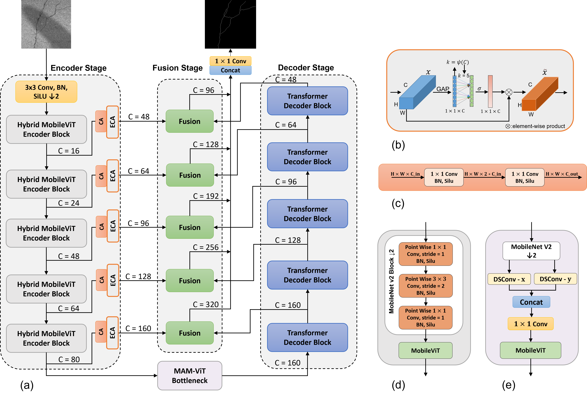

<h1 id="LiteCrackSeg">LiteCrackSeg: A lightweight hybrid CNN-transformer for efficient crack segmentation</h1>

  

<em>Figure 1. LiteCrackSeg model architecture.</em>

<h2 id="clone-repository">Clone Repository</h2>
<pre><code>git clone https://github.com/1Kaleb/LiteCrackSeg.git
cd LiteCrackSeg
</code></pre>

<h2 id="Download">Dataset</h2>

The DeepCrack dataset is available at <a href="https://github.com/yhlleo/DeepCrack/tree/master/dataset"><code>here</code></a>.

The CrackMap dataset is available at <a href="https://github.com/ikatsamenis/CrackMap"><code>here</code></a>.

The TUT dataset is available at <a href="https://github.com/Karl1109/TUT"><code>here</code></a>.

<h2 id="structure">Dataset Directory Structure</h2>
<pre><code>|-- datasets
    |-- TUT
        |-- train
        |   |-- train.txt
        |   |-- Train_image
        |   |   |-- &lt;crack1.jpg&gt;
        |   |-- Label_image
        |   |   |-- &lt;crack1.png&gt;
        |-- valid
        |   |-- valid.txt
        |   |-- Valid_image
        |   |   |-- &lt;crack11.jpg&gt;
        |   |-- Label_image
        |   |   |-- &lt;crack11.png&gt;
        |-- test
        |   |-- test.txt
        |   |-- Test_image
        |   |   |-- &lt;crack111.jpg&gt;
        |   |-- Label_image
        |   |   |-- &lt;crack111.png&gt;
        ......
</code></pre>

<h3 id="train-txt-format">train.txt format</h3>
<pre><code>./datasets/TUT/train/Train_image/crack1.jpg ./datasets/TUT/train/Label_image/crack1.png
./datasets/TUT/train/Train_image/crack2.jpg ./datasets/TUT/train/Label_image/crack2.png
.....
</code></pre>

<h2 id="Train the Model">Train the Model</h2>

Before training, change the paths including "train_data_path"(for train.txt), val_data_path (for valid.txt) and adjust the batch size, learning rate in config.py. Then run: 

<pre><code>python train.py</code></pre>

<h2 id="Prediction">Prediction</h2>

You can download the pretrained models from <a href="https://drive.google.com/file/d/12BDNmnJYWvVhkGNI0m2zGQdJHBoGTOHs/view?usp=sharing"><code>here</code></a>. To run the prediction.

<pre><code>python test.py</code></pre>

<h2 id="Eval">Evaluation</h2>
<pre><code>python eval.py</code></pre>

<h2 id="contact">Contact</h2>

  For inquiries, please contact
  <strong>Kaleb Amsalu Gobena</strong> //
  <strong>Galana Fekadu Asafa</strong>
  (Email: 
  <a href="mailto:kaleb.amsalu@csu.edu.cn">kaleb.amsalu@csu.edu.cn</a>).
  <a href="mailto:nafsiif911@gmail.com">nafsiif911@gmail.com</a>).

